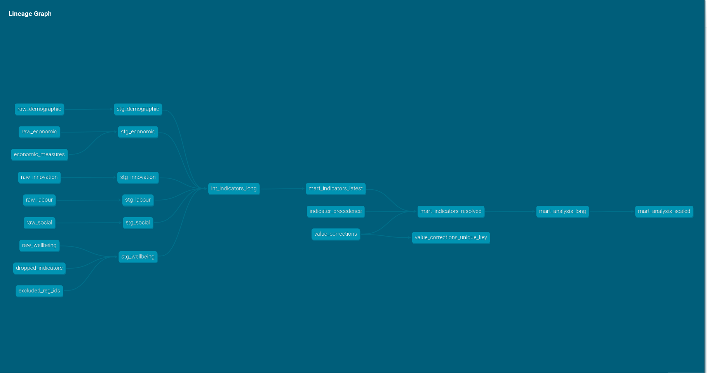

# OECD Regional Well-Being — Pipeline and Analysis


A reproduction of a published study on subjective well-being across 388 OECD
regions, rebuilt end to end: the data preparation as a tested dbt project over
DuckDB, and the machine-learning analysis in Python with scikit-learn.

The original was written in R — dplyr for the data, `ranger`, `tidymodels` and
`iml` for the analysis. **The rebuilt data pipeline reproduces the published
dataset exactly**, and the rebuilt analysis reproduces its substantive findings.

---

## How the repository is organised

The project is one pipeline in two stages, with a deliberate seam between them.

```
transform/     dbt project     OECD source files -> analysis-ready tables (SQL)
analysis/      Python package  tables -> models, importance, ALE, interactions
legacy/        reference       the original pandas implementation
tests/         pytest          parity checks, plus the CI fixture
*.qmd          Quarto          the documents that read from both
```

**The seam is the mart.** SQL ends with a long table of one value per region and
indicator; Python starts by reading it. Everything upstream is a transformation
with a fixed schema — filter, join, aggregate, deduplicate — which is what SQL is
for and what dbt can test. Everything downstream is procedural: model fitting,
resampling, a sweep over parameterised datasets, plotting. Forcing either side
across that line would be dogma.

One practical consequence: the warehouse stays in **long format** throughout. The
pivot to wide happens at the Python boundary, because a table with several
hundred data-dependent column names cannot be tested — you cannot write a
not-null assertion against a column whose name is not known until runtime.

### Documents

| File | What it does |
|---|---|
| `analysis.qmd` | The reproduction: selection, tuning, model comparison, interpretation |
| `frontier_comparison.qmd` | Robustness across the completeness frontier (see below) |

Both read from cached artifacts and modules; neither contains analysis logic of
its own.

---

## Part 1 — The data pipeline

### Why dbt for a small dataset

The final analysis dataset is 388 rows by 135 columns. Pandas handled it
perfectly well, and nothing here is faster because it is written in SQL.

The rewrite was not about performance. It was about four things the original
scripts could not provide:

- **Declarative tests** that run on every commit, rather than assertions that
  fire only when someone happens to execute the script.
- **Lineage** — a dependency graph showing how every column reaches the final
  dataset.
- **Documented decisions** — exclusions, corrections and precedence rules live in
  version-controlled CSVs with a stated justification per row, not as literals
  inside function bodies.
- **Environment independence** — CI builds the whole pipeline in a clean
  container, so nothing can silently depend on one laptop.

The same structure would hold if the data grew, but that is not the claim being
made here.

### What the tests found

The rewrite was not expected to change any results. It surfaced four things the
original pipeline resolved silently:

**Territorial levels duplicate regions.** OECD publishes each series at several
territorial levels (TL1 national, TL2 large regions, TL3 small regions). A
uniqueness test on `(region, indicator, year)` failed with 37,108 duplicates.
TL1 rows are country aggregates and are not regions at all.

**The same region code can mean different geography.** Zeeland (`NL34`) appears
at TL2 with a waste value of 71 and at TL3 with 78 — genuinely different areas
sharing a code. The original deduplicated on keys while ignoring the value, so
one of the two was chosen by row order.

**A naive fix would have dropped Estonia.** Filtering to `TL = 2` looked like the
clean solution, but five Estonian regions (`EE001`–`EE008`) are published only at
TL3 and would have vanished without any error. The rule is therefore a preference
with a fallback: TL2 where available, TL3 otherwise. Estonia's own TL2 entry
(`EE00`) carries a single indicator and no life-satisfaction value, so the
completeness filter removes it and the territory is not counted twice.

**The country exclusion list was incomplete.** It enumerated 34 ISO3 codes but
omitted Latvia and Lithuania, which joined the OECD around the time this vintage
was compiled. The structural rule — exclude TL1 — covers them; the enumerated
list did not.

None of these changed the published results. They were found because the tests
asked precise questions.

### Architecture



| Layer | Contents | Purpose |
|---|---|---|
| `raw` | 6 models | Immutable snapshot of each OECD CSV, with an ingestion timestamp. No logic. |
| `staging` | 6 models | Types, renames, source-fidelity filters, territorial-level resolution. Full history retained. |
| `intermediate` | 1 model | All six sources unioned into one long table. |
| `marts` | 6 models | Analysis decisions: year cutoff, latest-per-series, region restriction, precedence, corrections, completeness, scaling, and the completeness frontier. |
| `seeds` | 5 CSVs | Data decisions as reviewable tables, each row carrying a reason. |

The staging/marts boundary is deliberate. Staging represents each source
faithfully, so the warehouse can answer questions the original analysis did not
ask — coverage over time, cross-source comparison, alternative cutoffs.
Everything specific to *this* study lives in marts.

### Data decisions as seeds

| Seed | What it declares |
|---|---|
| `excluded_reg_ids` | Country-level codes appearing as region identifiers |
| `dropped_indicators` | Indicators removed before the completeness filter |
| `economic_measures` | Which measurement bases are used from the economic file |
| `indicator_precedence` | Which source wins for indicators published in more than one file |
| `value_corrections` | Manual corrections, as a multiplier with a verifiable justification |

`value_corrections` holds one row: region `DE7`'s 2001 surface area is wrong by
an order of magnitude in the source, inflating its density growth index by a
factor of 100. Verified by recomputing from the 2002 surface area.

---

## Part 2 — The analysis

Predictors are selected by recursive elimination on random forest importance,
the model is tuned by cross-validation, and the fitted model is interpreted
through permutation importance, ALE curves and interaction statistics.

| Module | Contents |
|---|---|
| `select_features.py` | Recursive elimination; one-standard-error selection rule |
| `tune.py` | Latin-hypercube search over random forest and XGBoost parameters |
| `importance.py` | Permutation importance as an MSE ratio |
| `ale.py` | Accumulated Local Effects, 1D and 2D |
| `interactions.py` | Friedman's H-statistic, overall and pairwise |
| `frontier.py` | Reading points on the completeness frontier |
| `pipeline.py` | The whole analysis for one dataset, as cacheable artifacts |
| `run_frontier.py` | Batch runner across the frontier |

### Two methods implemented directly

`iml`'s ALE and Friedman's H-statistic have no scikit-learn equivalent, so both
are implemented here. Rather than reimplementing from the concept, the R source
of `iml::FeatureEffect` was consulted so the numerical procedure matches —
including the parts that are easy to get wrong, such as imputing empty 2D grid
cells from their nearest occupied neighbour and removing main effects through
accumulated weighted differences rather than simple centring.

Both are verified against structures with known answers: the 2D ALE of an
exactly additive model is zero to machine precision; the surface for `f = a·b`
recovers `a·b`; the H-statistic is 0.000 for every feature of an additive model
and 0.857 for an interacting pair.

An incidental finding from those checks, worth knowing when reading the results:
a random forest fitted on the *additive* function `2a + 2b` produces a 2D ALE
surface with range 4.16, not zero. Tree ensembles manufacture interactions that
are not in the data. This is why the analysis carries XGBoost through as a
robustness check — agreement between two model families is what separates signal
from artefact.

### What reproduced

**Predictor selection: 14 of 16.** The two differences are near-collinear
substitutes — Python selected `HOMIC_RA` and `VOTERS_SH` where R selected
`KID_WOM_RA_T` and `SR_TOT_RA_T`, the latter being a near-duplicate of the
`SR_ELD_RA_T` that both retained. When two predictors carry nearly the same
information, impurity importance splits arbitrarily between them.

**Model ordering, on held-out data:**

| | R (`ranger` / `tidymodels`) | Python (scikit-learn) |
|---|---|---|
| Random forest | RMSE 0.525, R² 0.777 | RMSE 0.496, R² 0.759 |
| XGBoost | RMSE 0.544, R² 0.737 | RMSE 0.519, R² 0.736 |
| Linear model | RMSE 0.621, R² 0.666 | RMSE 0.613, R² 0.632 |

Both tree ensembles substantially outperform OLS in both implementations, with
the forest marginally ahead of XGBoost. Exact agreement is not expected: a
different split, a different grid draw, and a slightly different predictor set.

**Interaction structure, with a refinement.** The manuscript identifies the
employment rate as the strongest interactor and pairs it with the elderly sex
ratio. Here, social support and the elderly sex ratio rank first and second in
both model families (forest 0.136 / 0.127; XGBoost 0.315 / 0.265), clearly
separated from third place. The margin between them is narrow enough that which
leads is not established — the honest statement is that the two are jointly
strongest, which refines the manuscript's claim rather than contradicting it.

One interpretive caveat the original does not raise: social support, perceived
corruption and the outcome are all subjective survey measures, so an interaction
among them may partly reflect shared response style. The elderly sex ratio,
being a demographic count, does not have that problem.

---

## Part 3 — The completeness frontier

The analysis requires every indicator to be observed for every region, so one
poorly-covered region removes an indicator for all of them. Dropping the
worst-covered regions buys indicators back. The published analysis sits at one
point on that trade-off without examining it.

Sweeping the trade-off shows the gain is concentrated almost entirely at the
start: **dropping 10 of 388 regions (2.6%) gains 44 indicators**, from 135 to
179. The following seventy regions dropped gain one more. Total data — regions
times indicators — peaks at that first step and declines monotonically after, so
every later point trades observations away without recovering breadth.

`frontier_comparison.qmd` runs the full analysis at several points and compares
the results. Its key figure tracks predictor selection across the frontier at
the level of the underlying **concept** rather than the specific indicator,
because the richer datasets substitute finer-grained measures within the same
family — `EMP_RA` gives way to measures such as `EMP_SH_PT_F`. Read at the
indicator level that looks like employment ceasing to matter; read at the
concept level it is a shift in *which aspect* of employment carries the signal.

These are exploratory robustness checks, not tests. The datasets are nested
subsets, the same data drives both selection and evaluation, and the retained
sample changes at every step — so a difference between two steps is not a
measured effect. Cross-step predictive performance is deliberately not compared:
later steps appear to predict better simply because the surviving regions are
better documented and easier to predict.

---

## Running it

```bash
python3 -m venv .venv && source .venv/bin/activate
pip install -r requirements.txt
```

Build the warehouse:

```bash
cd transform && dbt deps && dbt build
```

Verify parity against the published dataset:

```bash
pytest tests/
```

Render the analysis:

```bash
quarto render analysis.qmd
```

Run the frontier sweep — a batch job of roughly five minutes per step — then
render the comparison:

```bash
python -m analysis.run_frontier --steps 0 10 20 100 150
quarto render frontier_comparison.qmd
```

`requirements.txt` installs everything, including the Quarto render stack. `requirements-pipeline.txt` is the smaller set needed to build the warehouse and run the tests — it is what CI installs.

### Two environment notes

**DuckDB allows many readers or one writer.** An interactive session holding a
write lock will block `dbt build`. Open read-only in notebooks:
`duckdb.connect("warehouse.duckdb", read_only=True)`.

**Positron injects its bundled kernel libraries onto `PYTHONPATH`**, which makes
pip skip installing them into the virtual environment while Quarto — running in
a plain shell — cannot find them. If a render fails on a missing `zmq`,
`traitlets` or similar, install and render with `env -u PYTHONPATH`.

## Verification

Two levels, verifying different things:

- **CI**, on every push: builds the full pipeline in a clean container against a
  small committed fixture and runs all dbt tests. This proves the pipeline runs
  and its internal assertions hold. It does **not** prove parity — the fixture is
  not the full dataset.
- **Locally**: `tests/test_parity.py` compares the mart against the published
  `data_unscaled.parquet` and asserts every value matches within `1e-9`. It skips
  automatically when the published file is absent.

Parity last confirmed against the full data on **2026-08-28**: 388 regions,
135 indicators, maximum absolute difference `1.8e-15` — floating-point noise on
the DE7 correction, where the original divides by 100 and this pipeline
multiplies by 0.01. Every other value is bit-identical.

## Data

Source: OECD Regional Statistics, 2016 vintage —
<https://www.oecd-ilibrary.org/urban-rural-and-regional-development/data/oecd-regional-statistics_region-data-en>

Six databases are used: regional well-being, demography, economy, innovation,
labour markets, and social and environmental indicators.

The files are not committed — roughly 3 GB, with the largest single file
exceeding GitHub's limit. A small fixture covering a handful of regions across
all six files is committed at `tests/fixtures/` so CI can build the pipeline end
to end.

The original data and published analysis code are archived at
<https://doi.org/10.5281/zenodo.10436448> (CC-BY).

## The study

**Gender and age matter! Identifying important predictors for subjective
well-being using machine learning methods.**

Subjective well-being has become a key measure of societal progress beyond GDP,
but most quantitative work uses few variables and assumes linearity. The study
applies random forests to predict regional well-being averages across 388 OECD
regions, identifying 16 key predictors along with substantial non-linearities
and interactions. The sex ratio among the elderly — largely unexamined in the
existing literature — emerges as roughly as important as average disposable
income.

## Notes

Predictor-selection code in the original analysis was adapted from
<https://github.com/SimonLarsen/varSelRanger>. The ALE implementation follows
`iml` (Molnar & Schratz); the H-statistic follows Friedman & Popescu.

Data citation: OECD (2023). *OECD Regional Statistics.*
DOI: 10.1787/region-data-en